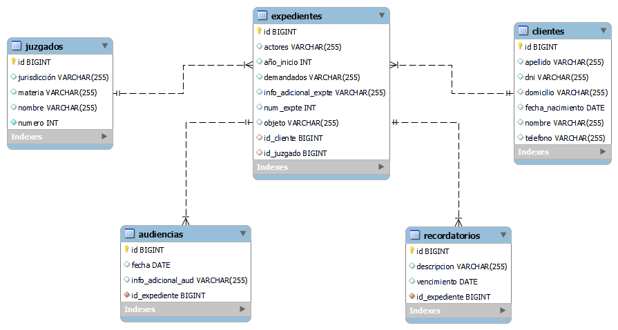

# paralegal-project
Proyecto personal y puesta en practica de conocimientos en backend y práctica de React. (En proceso)

## Tabla de Contenido
1. [Información general](#general-info)
2. [Tecnologías](#technologies)

### Información general
***
Idea de aplicación de organización del estudio jurídico, especia de estudio virtual. El objetivo sería tener la posibilidad de crear Cards particulares de juicios, clientes, registro de gastos por cobrar a los clientes, entre otras cosas.
Actualmente se encuentra en proceso. 
Proyecto creado en arquitectura monolítica. Generación de CRUD para diferentes entidades a utilizar en aplición.

- El back-end está realizado en lenguaje de programación Java pero sin testeos más que su funcionamiento general con Postman. Se encuentra documentado con Swagger y posee conexión con Base de Datos MySQL.
- El Front-end se encuentra apenas iniciado. Se espera continuar y se irá realizando en React.

  

### Tecnologías
***
- Java
- Spring Framework
- Base de datos MySQL
- Hibernate
- Lombok
- Swagger
- React
- HTML5
- CSS3
